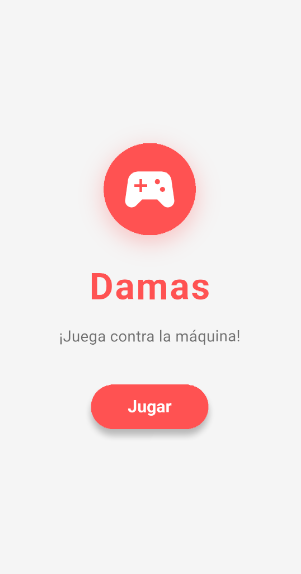

# Damas X

Aplicación de Juego de Damas desarrollada en Flutter.

## Vista previa

## ¿Qué hace esta aplicación?

Damas X es un juego de damas clásico donde puedes jugar contra la máquina. Incluye:

- Tablero de 8x8 con fichas para el jugador y la IA.
- Turnos alternos entre el jugador y la máquina.
- Promoción a dama (reina) cuando una ficha llega al extremo opuesto.
- Animaciones y sonidos para movimientos, capturas, victoria y derrota.
- Detección automática de fin de partida y anuncio del ganador.
- Interfaz moderna y atractiva.

## Cómo empezar

Ejecuta la aplicación en tu dispositivo o emulador con Flutter para comenzar a jugar.

---